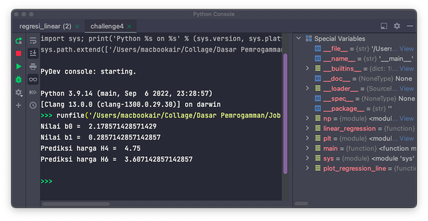
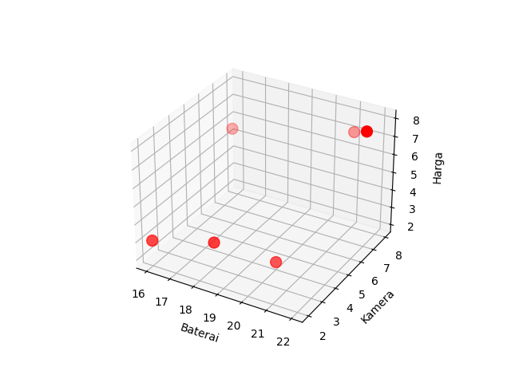

### DASAR PEMROGRAMAN JOB SHEET 4: LIST DAN TUPLE
<p align="center">
    
</p>

#### Dibuat dan disusun oleh
| Variabel | Nilai               |
|----------|---------------------|
| Nama     | Naufal Reky Ardhana |
| NIM      | 4.33.22.0.21        |
| Kelas    | TI-1A               |

**PROGRAM STUDI TEKNIK INFORMATIKA JURUSAN TEKNIK ELEKTRO POLITEKNIK NEGERI SEMARANG - 2022**

#### Daftar Isi
* [BAB I. Landasan Teori](#bab-i-landasan-teori)
* [BAB II. List](#bab-ii-list)
* [BAB III. Tuple](#bab-iii-tuple)
* [BAB IV. Kegunaan List dan Tuple](#bab-iv-kegunaan-list-dan-tuple)
* [BAB V. Praktikum](#bab-v-praktikum)
  * [Alat dan Bahan](#alat-dan-bahan)
  * [Challenge 1 & 2](#challenge-1--2)
  * [Challenge 3](#challenge-3)
  * [Challenge 4](#challenge-4)
  * [Challenge 5](#challenge-5)

#### BAB I. Landasan Teori
Di dalam bahasa pemrograman Python, terdapat dua tipe data yang dapat digunakan untuk menyimpan kumpulan data, yaitu list dan tuple. Keduanya dapat menyimpan kumpulan data, baik itu berupa angka, string, maupun tipe data lainnya. Perbedaan utama dari kedua tipe data tersebut adalah list bersifat mutable, sedangkan tuple bersifat immutable. Dalam bab ini, akan dibahas mengenai list dan tuple, serta perbedaan dan kegunaan dari kedua tipe data tersebut.

#### BAB II. List
List adalah salah satu tipe data yang dapat digunakan untuk menyimpan kumpulan data. List bersifat mutable, artinya data yang disimpan dalam list dapat diubah. List dapat menyimpan data dengan tipe data yang berbeda, baik itu angka, string, maupun tipe data lainnya. List dapat dibuat dengan cara menuliskan data yang akan disimpan dalam list, dipisahkan dengan koma, di dalam tanda kurung siku. Contoh:
```python
list = [1, 2, 3, 4, 5]
```
Sifat dari nilai List (item) yaitu terurut (ordered), dapat diubah (changeable), dan membolehkan nilai yang sama (duplicate). Data dari list diurutkan dalam bentuk indeks mulai dari [0], [1], dan seterusnya. Item dari List mempunyai urutan tertentu dan tidak berubah, jika terdapat item baru maka item tersebut ditempatkan pada urutan terakhir. Item dari List dapat diubah dengan cara ditambah dan dihapus setelah dibuat

#### BAB III. Tuple
Tuple adalah salah satu tipe data yang dapat digunakan untuk menyimpan kumpulan data. Tuple bersifat immutable, artinya data yang disimpan dalam tuple tidak dapat diubah. Tuple dapat menyimpan data dengan tipe data yang berbeda, baik itu angka, string, maupun tipe data lainnya. Tuple dapat dibuat dengan cara menuliskan data yang akan disimpan dalam tuple, dipisahkan dengan koma, di dalam tanda kurung biasa. Contoh:
```python
tuple = (1, 2, 3, 4, 5)
```
Sifat dari nilai Tuple (item) yaitu terurut (ordered), tidak dapat diubah (unchangeable), dan membolehkan nilai yang sama (duplicate). Data dari tuple diurutkan dalam bentuk indeks mulai dari [0], [1], dan seterusnya. Item dari Tuple mempunyai urutan tertentu dan tidak berubah, jika terdapat item baru maka item tersebut ditempatkan pada urutan terakhir. Item dari Tuple tidak dapat diubah dengan cara ditambah dan dihapus setelah dibuat

#### BAB IV. Kegunaan List dan Tuple
List dan tuple memiliki kegunaan yang berbeda. List bersifat mutable, artinya data yang disimpan dalam list dapat diubah. Sedangkan tuple bersifat immutable, artinya data yang disimpan dalam tuple tidak dapat diubah. Kegunaan dari list adalah untuk menyimpan data yang dapat diubah, seperti data yang akan diubah oleh pengguna. Sedangkan tuple digunakan untuk menyimpan data yang tidak dapat diubah, seperti data yang tidak akan diubah oleh pengguna.

#### BAB V. Praktikum
##### Alat dan Bahan
- Laptop
- Python `3.10.0`
- PyCharm `2021.2.3`
- Git `2.33.0`

##### Challenge 1 & 2
Sebuah projek aplikasi dibangun menggunakan pemrograman Python. Aplikasi ini dapat menyimpan dan mencari data mahasiswa berupa NIM, Nama, dan Email. Objek yang digunakan untuk menampung data adalah List. Aplikasi juga dapat menampilkan semua data.

1. Buat sebuah projek baru dengan nama `job-sheet-4` menggunakan PyCharm.
2. Buat sebuah file dengan nama `main.py` di dalam projek tersebut.
3. Buat sebuah list kosong dengan nama `mahasiswa`.
4. Buat sebuah fungsi dengan nama `tambah_mahasiswa` yang menerima parameter `nim`, `nama`, dan `email`. Fungsi ini akan menambahkan data mahasiswa ke dalam list `mahasiswa`.
5. Buat sebuah fungsi dengan nama `cari_mahasiswa` yang menerima parameter `nim`. Fungsi ini akan mencari data mahasiswa berdasarkan NIM yang dimasukkan oleh pengguna. Jika data ditemukan, maka fungsi ini akan mengembalikan data mahasiswa tersebut. Jika data tidak ditemukan, maka fungsi ini akan mengembalikan `None`.
6. Buat sebuah fungsi dengan nama `tampilkan_mahasiswa` yang tidak menerima parameter.
7. Buat sebuah fungsi dengan nama `edit_mahasiswa` yang menerima parameter `nim`, `nama`, dan `email`. Fungsi ini akan mencari data mahasiswa berdasarkan NIM yang dimasukkan oleh pengguna. Jika data ditemukan, maka fungsi ini akan mengubah data mahasiswa tersebut. Jika data tidak ditemukan, maka fungsi ini akan menampilkan pesan `Data mahasiswa tidak ditemukan`.
8. Buat sebuah fungsi dengan nama `hapus_mahasiswa` yang menerima parameter `nim`. Fungsi ini akan mencari data mahasiswa berdasarkan NIM yang dimasukkan oleh pengguna. Jika data ditemukan, maka fungsi ini akan menghapus data mahasiswa tersebut. Jika data tidak ditemukan, maka fungsi ini akan menampilkan pesan `Data mahasiswa tidak ditemukan`.
9. Buat sebuah perulangan while yang akan berjalan selama True.
10. Di dalam perulangan while, tampilkan menu aplikasi.
11. Buat sebuah variabel dengan nama `pilihan` yang menyimpan input dari pengguna.
12. Buat sebuah kondisi if dengan kondisi `pilihan == 1`. Jika kondisi tersebut bernilai True, maka panggil fungsi `tambah_mahasiswa`.
13. Buat sebuah kondisi elif dengan kondisi `pilihan == 2`. Jika kondisi tersebut bernilai True, maka panggil fungsi `cari_mahasiswa`.
14. Buat sebuah kondisi elif dengan kondisi `pilihan == 3`. Jika kondisi tersebut bernilai True, maka panggil fungsi `tampilkan_mahasiswa`.
15. Buat sebuah kondisi elif dengan kondisi `pilihan == 4`. Jika kondisi tersebut bernilai True, maka panggil fungsi `edit_mahasiswa`.
16. Buat sebuah kondisi elif dengan kondisi `pilihan == 5`. Jika kondisi tersebut bernilai True, maka panggil fungsi `hapus_mahasiswa`.
17. Buat sebuah kondisi elif dengan kondisi `pilihan == 6`. Jika kondisi tersebut bernilai True, maka keluar dari perulangan while.
18. Buat sebuah kondisi else. Jika kondisi tersebut bernilai True, maka tampilkan pesan `Pilihan tidak ditemukan`.
```python
from prettytable import PrettyTable

mahasiswa = []


def tambah_mahasiswa(nim, nama, email):
    mahasiswa_baru = {
        "nim": nim,
        "nama": nama,
        "email": email
    }
    mahasiswa.append(mahasiswa_baru)


def cari_mahasiswa(nim):
    for mhs in mahasiswa:
        if mhs["nim"] == nim:
            return mhs
    return None


def edit_mahasiswa(nim, nama, email):
    for mhs in mahasiswa:
        if mhs["nim"] == nim:
            mhs["nama"] = nama
            mhs["email"] = email
            return True
    return None


def hapus_mahasiswa(nim):
    for mhs in mahasiswa:
        if mhs["nim"] == nim:
            mahasiswa.remove(mhs)
            return True
    return False


# tampilkan data mahasiswa menggunakan prettytables
def tampilkan_mahasiswa():
    table = PrettyTable()
    table.field_names = ["NIM", "Nama", "Email"]
    for mhs in mahasiswa:
        table.add_row([mhs["nim"], mhs["nama"], mhs["email"]])
    print(table)


def main():
    while True:
        print("=== Aplikasi Data Mahasiswa ===")
        print("1. Tambah Data Mahasiswa")
        print("2. Cari Data Mahasiswa")
        print("3. Tampilkan Data Mahasiswa")
        print("4. Edit Data Mahasiswa")
        print("5. Hapus Data Mahasiswa")
        print("6. Keluar")
        pilihan = input("Pilih menu> ")

        # clear screen
        print("\n" * 100)

        if pilihan == "1":
            print("=== Tambah Data Mahasiswa ===")
            nim = input("NIM: ")
            nama = input("Nama: ")
            email = input("Email: ")
            tambah_mahasiswa(nim, nama, email)
            
        elif pilihan == "2":
            print("=== Cari Data Mahasiswa ===")
            nim = input("NIM: ")
            mhs = cari_mahasiswa(nim)
            if mhs is not None:
                print("Data mahasiswa:")
                print("NIM: ", mhs["nim"])
                print("Nama: ", mhs["nama"])
                print("Email: ", mhs["email"])
            else:
                print("Data mahasiswa tidak ditemukan")
        elif pilihan == "3":
            print("=== Tampilkan Data Mahasiswa ===")
            tampilkan_mahasiswa()
            
        elif pilihan == "4":
            print("=== Edit Data Mahasiswa ===")
            nim = input("NIM : ")
            cari_data = cari_mahasiswa(nim)
            if cari_data:
                nama = input("Input nama baru : ")
                email = input("Input email baru: ")
                if edit_mahasiswa(nim, nama, email):
                    print("Data berhasil diubah")
                    
        elif pilihan == "5":
            print("=== Hapus Data Mahasiswa ===")
            nim = input("NIM : ")
            if hapus_mahasiswa(nim):
                print("Data berhasil dihapus")
            else:
                print("Data tidak ditemukan")
                
        elif pilihan == "6":
            break
            
        else:
            print("Menu tidak tersedia")


if __name__ == "__main__":
    main()
```
##### Challenge 3
Seorang developer diberi tugas untuk membuat penjumlahan, pengurangan, dan perkalian matriks dua dimensi menggunakan List. Program ditampilkan dalam 4 menu matriks : Penjumlahan, Pengurangan, Perkalian, dan Keluar. Data matrik dimasukan oleh pengguna. Pada bagian akhir, program menampilkan hasil operasi matriks.

```python
import os
import sys
import time
import numpy as np


def clear():
    os.system('cls' if os.name == 'nt' else 'clear')


def menu():
    print("=== Aplikasi Operasi Matriks ===")
    print("1. Penjumlahan")
    print("2. Pengurangan")
    print("3. Perkalian")
    print("4. Keluar")
    pilihan = input("Pilih menu> ")
    return pilihan


def input_matriks():
    baris = int(input("Masukkan jumlah baris: "))
    kolom = int(input("Masukkan jumlah kolom: "))
    matriks = []
    for i in range(baris):
        row = []
        for j in range(kolom):
            row.append(int(input(f"Masukkan nilai matriks ({i + 1}, {j + 1}): ")))
        matriks.append(row)
    return matriks


def penjumlahan():
    print("=== Penjumlahan Matriks ===")
    print("Matriks A")
    matriks_a = input_matriks()
    print("Matriks B")
    matriks_b = input_matriks()
    matriks_c = np.add(matriks_a, matriks_b)
    print("Hasil Penjumlahan")
    print(matriks_c)
    time.sleep(3)
    clear()
    return menu()


def pengurangan():
    print("=== Pengurangan Matriks ===")
    print("Matriks A")
    matriks_a = input_matriks()
    print("Matriks B")
    matriks_b = input_matriks()
    matriks_c = np.subtract(matriks_a, matriks_b)
    print("Hasil Pengurangan")
    print(matriks_c)
    time.sleep(3)
    clear()
    return menu()


def perkalian():
    print("=== Perkalian Matriks ===")
    print("Matriks A")
    matriks_a = input_matriks()
    print("Matriks B")
    matriks_b = input_matriks()
    matriks_c = np.dot(matriks_a, matriks_b)
    print("Hasil Perkalian")
    print(matriks_c)
    time.sleep(3)
    clear()
    return menu()


def main():
    while True:
        pilihan = menu()
        if pilihan == "1":
            penjumlahan()
        elif pilihan == "2":
            pengurangan()
        elif pilihan == "3":
            perkalian()
        elif pilihan == "4":
            sys.exit()
        else:
            print("Pilihan tidak tersedia")
            time.sleep(3)
            clear()
            continue

main()
```

##### Challenge 4
Sebagai seorang developer anda diberi tugas untuk membuat aplikasi prediksi harga pada handphone dengan kamera 9 MP dan 5 MP (H4 dan H6) menggunakan algoritma regresi linier.

| Handphone | Kamera (MP) | Harga (Jutaan) |
|-----------|-------------|----------------|
| H1        | 8           | 7              |
| H2        | 2           | 3              |
| H3        | 6           | 7              |
| H4        | 9           | x              |
| H5        | 4           | 2              |
| H6        | 5           | x              |
| H7        | 7           | 8              |
| H8        | 3           | 3              |

Buatlah program untuk memprediksi harga handphone H4 dan H6 dengan menggunakan metode linear regression.

```python
import numpy as np
import matplotlib.pyplot as plt


def linear_regression(x, y):
    n = np.size(x)
    m_x, m_y = np.mean(x), np.mean(y)
    SS_xy = np.sum(y * x) - n * m_y * m_x
    SS_xx = np.sum(x * x) - n * m_x * m_x
    b_1 = SS_xy / SS_xx
    b_0 = m_y - b_1 * m_x
    return (b_0, b_1)


def plot_regression_line(x, y, b):
    plt.scatter(x, y, color="m", marker="o", s=30)
    y_pred = b[0] + b[1] * x
    plt.plot(x, y_pred, color="g")
    plt.xlabel("Kamera (MP)")
    plt.ylabel("Harga (Jutaan)")
    plt.show()


def main():
    x = np.array([8, 2, 6, 9, 4, 5, 7, 3])
    y = np.array([7, 3, 7, 0, 2, 0, 8, 3])
    b = linear_regression(x, y)
    print("Nilai b0 = ", b[0])
    print("Nilai b1 = ", b[1])
    plot_regression_line(x, y, b)
    print("Prediksi harga H4 = ", b[0] + b[1] * 9)
    print("Prediksi harga H6 = ", b[0] + b[1] * 5)
```

##### Challenge 5
Seorang developer diberi tugas untuk membuat aplikasi prediksi harga handphone dengan dua variabel independent (x) dan satu variabel dependent atau (y) dengan data sebagai berikut:

| Handphone | Baterai | Kamera (MP) | Harga (Jutaan) |
|-----------|---------|-------------|----------------|
| H1        | 21      | 8           | 7              |
| H2        | 16      | 2           | 3              |
| H3        | 17      | 6           | 7              |
| H4        | 14      | 9           | x              |
| H5        | 20      | 4           | 2              |
| H6        | 24      | 5           | x              |
| H7        | 22      | 7           | 8              |
| H8        | 18      | 3           | 3              |

Buatlah program untuk memprediksi harga handphone H4 dan H6 dengan menggunakan metode linear regression.

```python
import numpy as np
from sklearn.linear_model import LinearRegression

# data training
x = np.array([[21, 8], [16, 2], [17, 6], [14, 9], [20, 4], [24, 5], [22, 7], [18, 3]])
y = np.array([7, 3, 7, 0, 2, 0, 8, 3])
x.shape = (8, 2)
y.shape = (8, 1)

# inisialisasi model
model = LinearRegression()

# training model
model.fit(x, y)

# prediksi harga H4 dan H6
print("Prediksi harga H4 = ", model.predict([[14, 9]]))
print("Prediksi harga H6 = ", model.predict([[24, 5]]))

# tampikan grafik 3d
import matplotlib.pyplot as plt

fig = plt.figure()
ax = fig.add_subplot(111, projection='3d')
ax.scatter(x[:, 0], x[:, 1], y, c='r', marker='o')

x_surf = np.arange(0, 30, 1)
y_surf = np.arange(0, 10, 1)
x_surf, y_surf = np.meshgrid(x_surf, y_surf)
exog = np.array([x_surf.ravel(), y_surf.ravel()]).T
out = model.predict(exog)
ax.plot_surface(x_surf, y_surf, out.reshape(x_surf.shape), color='None', alpha=0.4)
ax.set_xlabel('Baterai')
ax.set_ylabel('Kamera')
ax.set_zlabel('Harga')
plt.show()
```
Grafik 3D dari data training dan hasil prediksi harga handphone H4 dan H6

